# Ứng Dụng Xem Phim Trực Tuyến

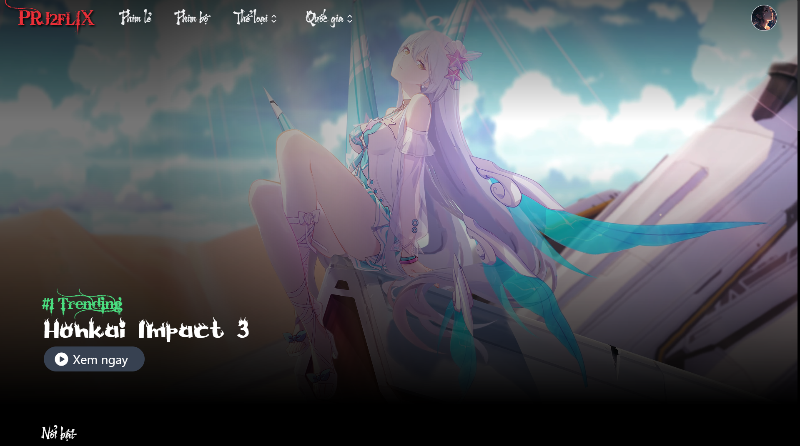
Chào mừng bạn đến với Ứng Dụng Xem Phim Trực Tuyến! Dự án này là một nền tảng web đầy đủ tính năng cho việc xem phim trực tuyến, được xây dựng bằng các công nghệ web hiện đại để mang lại trải nghiệm xem phim mượt mà.

## Tính Năng

####  **Người dùng**
- **Đăng nhập/Đăng ký**: Người dùng có thể tạo tài khoản mới hoặc đăng nhập để truy cập vào các tính năng của ứng dụng, đặc biệt có thể đăng nhập bằng các tài khoản mạng xã hội.
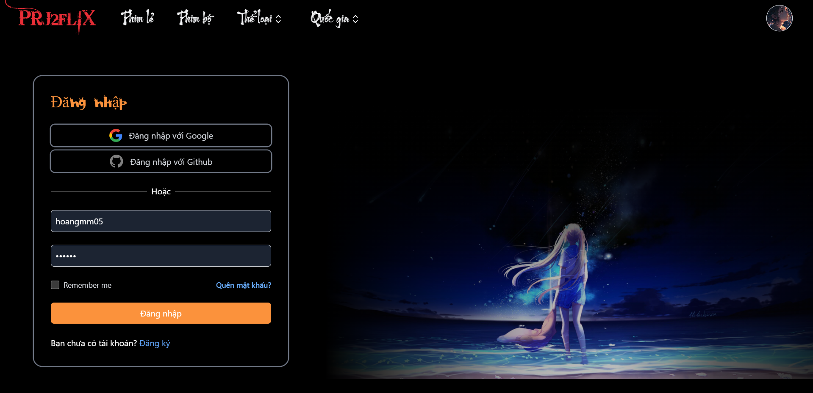
- **Xem phim trực tuyến**: Cung cấp kho phim đa dạng, chất lượng cao, hỗ trợ phát trực tuyến mượt mà.
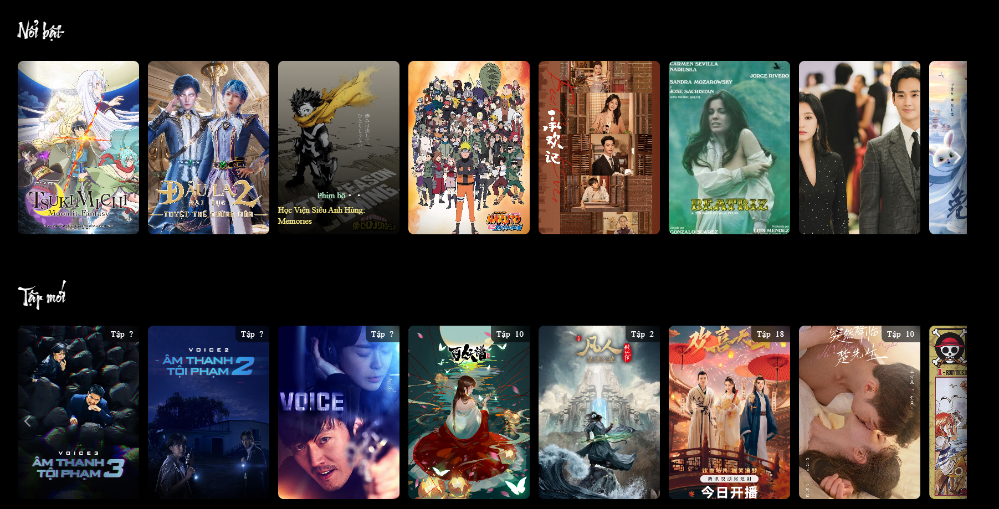
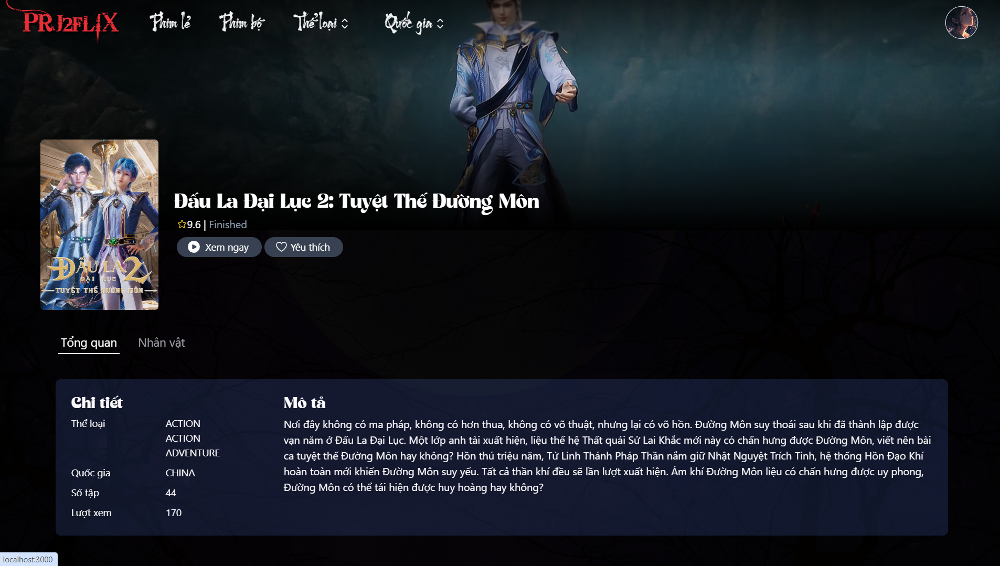
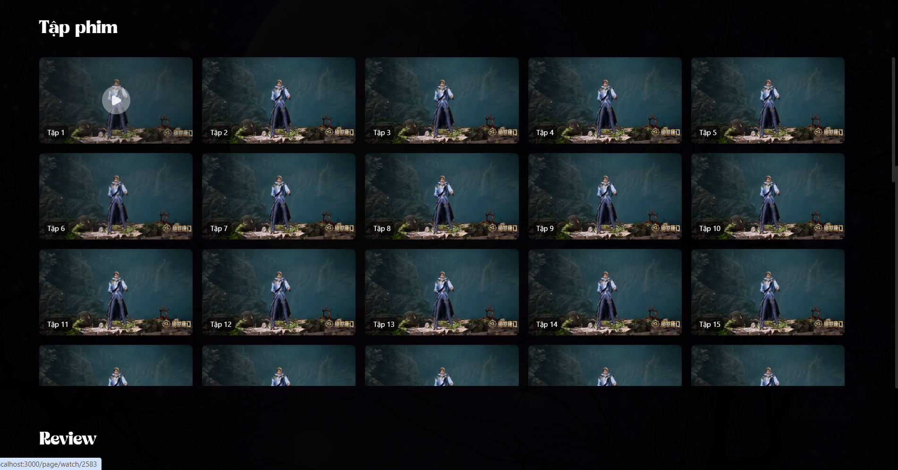
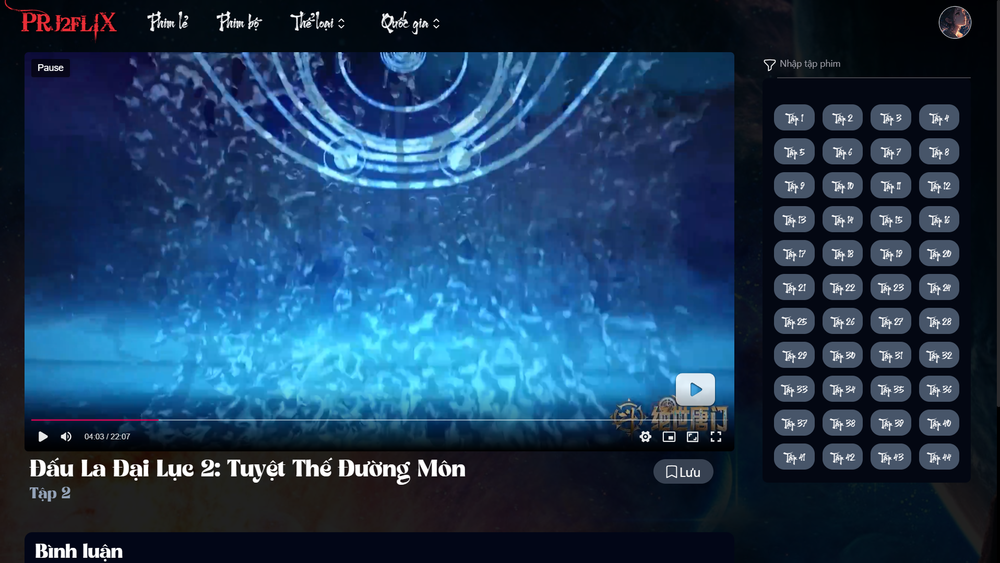
- **Tìm kiếm và phân loại**: Dễ dàng tìm kiếm phim theo tên, thể loại, và năm sản xuất.
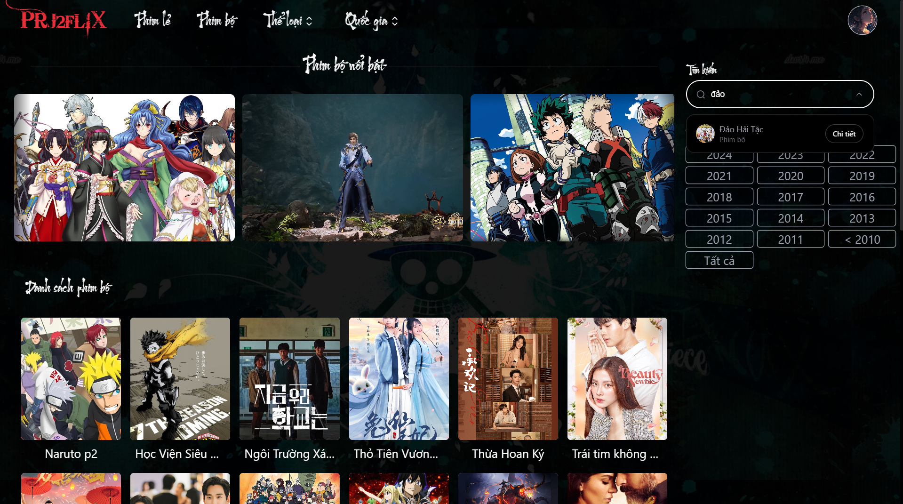
- **Danh sách yêu thích**: Người dùng có thể thêm phim vào danh sách yêu thích để xem sau.
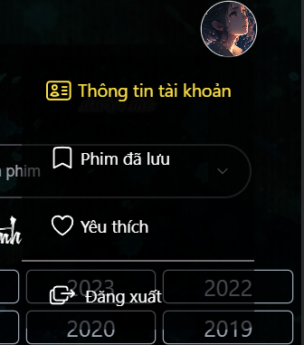
- **Bình luận và đánh giá**: Tương tác với cộng đồng người dùng bằng cách để lại bình luận và đánh giá phim.
- **Nạp tiền  online**: Người dùng có thể nạp tiền để đăng ký vip để có thể xem tất cả các phim qua hệ thống VNPay hoặc PayOs
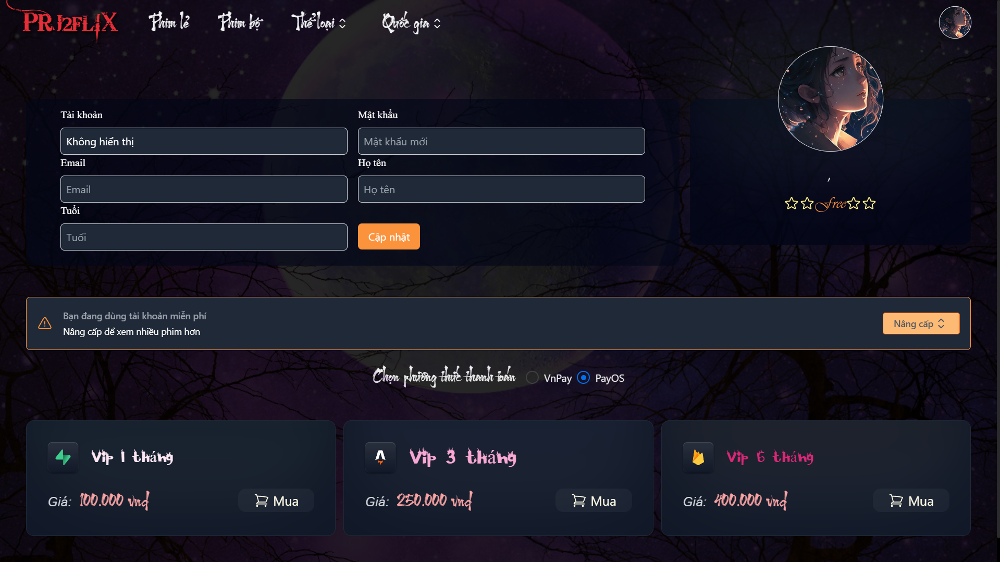
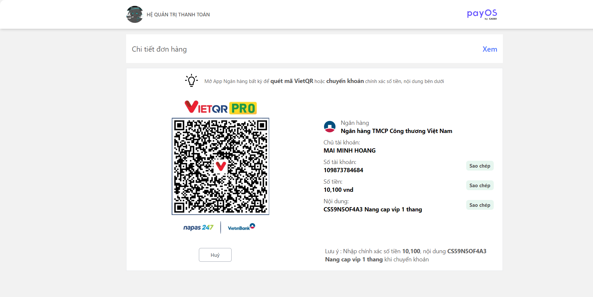
####  **Admin**
- **Thống kê doanh thu, giao dịch, phim, người dùng**: Giao diện thống kê trực quan dễ sử dụng
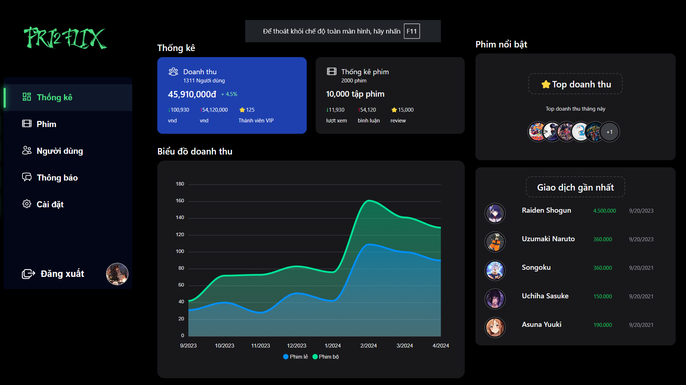
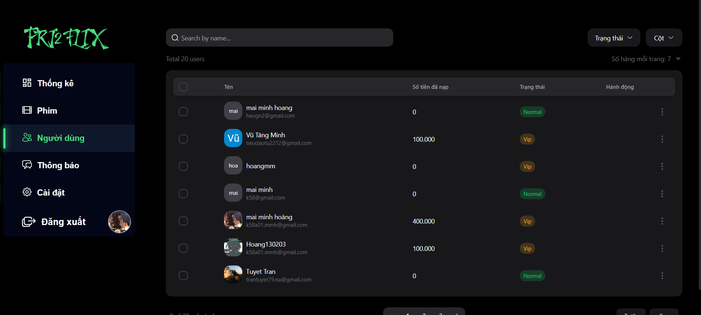
- **Thêm sửa xóa phim, đặc biệt có thể thêm hàng loạt phim bằng api bên thứ 3 như OPHIM1 api hoặc PHIMKK api**: có thể thêm phim một cách dễ dàng và linh hoạt
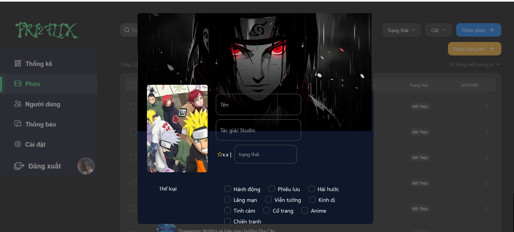
- **Và một số tính năng hữu ích khác**

####  **Responsive cho điện thoại để phù hợp với xu thế**
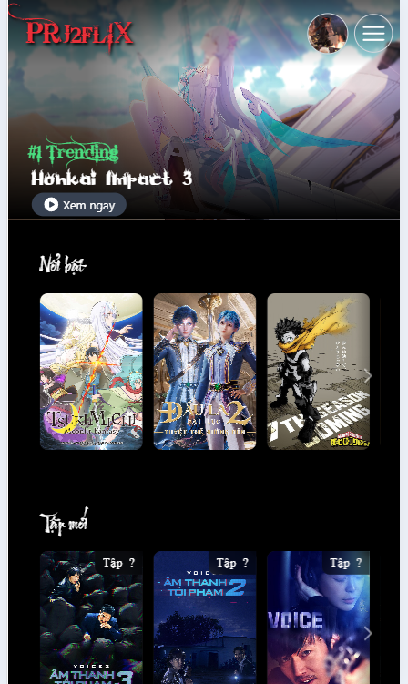 
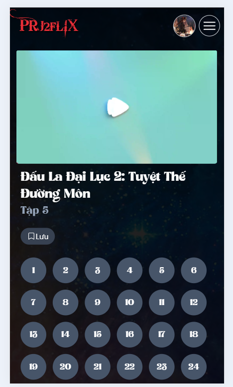
## Công Nghệ Sử Dụng

- **Spring Boot**: Backend framework giúp xây dựng các dịch vụ RESTful mạnh mẽ và dễ bảo trì.
- **Next.js**: Framework cho React, cung cấp khả năng render phía server và các tính năng tối ưu hóa SEO.
- **SQLServer**: Hệ quản trị cơ sở dữ liệu quan hệ để lưu trữ thông tin phim và người dùng.
- **Hibernate**: ORM (Object-Relational Mapping) để quản lý cơ sở dữ liệu trong ứng dụng Java.
- **Tailwind CSS**: Framework CSS để xây dựng giao diện người dùng hiện đại và phản hồi nhanh.
- **Phân quyền bằng spring security với các role rõ ràng, đảm bảo 1 phần tính bảo mật**
- **Cơ chế cache giúp giảm thời gian truy vấn**

